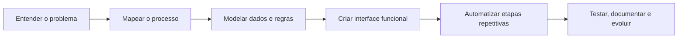

<p align="center">
  
</p>

<p align="center">
  <a href="https://www.linkedin.com/in/leonardo-farias-martins-160340215/">
    
  </a>
  <a href="mailto:hosttm123@gmail.com">
    
  </a>
  <a href="https://www.instagram.com/leonardommbr/">
    
  </a>
</p>

---

<table>
  <tr>
    <td width="55%">

## `> whoami`

Sou **Leonardo Farias**, formado em **Ciência da Computação** e focado em criar soluções que unem **tecnologia, processos administrativos e experiência de uso**.

Meu foco não é apenas escrever código.
É entender o problema, organizar o fluxo, automatizar o que é repetitivo e transformar uma rotina confusa em uma solução simples, visual e funcional.

Trabalho principalmente com:

* sistemas web;
* automação de processos;
* dashboards e gestão de dados;
* banco de dados;
* interfaces modernas;
* ferramentas para rotinas administrativas e operacionais.

</td>
<td width="45%">

## `status.dev`

```txt
name        Leonardo Farias
role        Systems Analyst
focus       Web • Automation • Data
stack       JS • TS • Node • Python
database    MySQL • Supabase
mission     build useful systems
```


</td>
  </tr>
</table>

---

## `> stack`

<p align="center">
  
</p>

<p align="center">
  
  
  
  
  
</p>

---

## `> área de atuação`

<table>
  <tr>
    <td align="center" width="25%">
      
      <br/>
      <b>Desenvolvimento Web</b>
      <br/>
      <sub>interfaces, sistemas e experiências digitais</sub>
    </td>
    <td align="center" width="25%">
      
      <br/>
      <b>Automação</b>
      <br/>
      <sub>menos tarefas repetitivas, mais produtividade</sub>
    </td>
    <td align="center" width="25%">
      
      <br/>
      <b>Dados</b>
      <br/>
      <sub>organização, análise e estruturação</sub>
    </td>
    <td align="center" width="25%">
      
      <br/>
      <b>Gestão</b>
      <br/>
      <sub>processos administrativos com tecnologia</sub>
    </td>
  </tr>
</table>

---

## `> como penso um projeto`



---

## `> projetos em destaque`

<table>
  <tr>
    <td width="50%">
      <h3>Estágio System</h3>
      <p>
        Sistema web desenvolvido para gestão de atividades de estágio, chamados, relatórios e acompanhamento de horas.
      </p>
      <p>
        <b>Stack:</b> HTML, CSS, JavaScript, Node.js, Express e MySQL.
      </p>
      <a href="https://github.com/DevOPhost/estagio-system">
        
      </a>
    </td>
    <td width="50%">
      <h3>Projetos Web e Automações</h3>
      <p>
        Repositórios voltados para sistemas administrativos, interfaces modernas, dashboards, automações e soluções digitais.
      </p>
      <p>
        <b>Foco:</b> utilidade real, organização, documentação e evolução constante.
      </p>
      <a href="https://github.com/DevOPhost?tab=repositories">
        
      </a>
    </td>
  </tr>
</table>

---

## `> github analytics`

<p align="center">
  
  
</p>

<p align="center">
  
</p>

---

## `> trophies`

<p align="center">
  
</p>

---

## `> além do código`

<table>
  <tr>
    <td width="33%">
      <b>Visão administrativa</b>
      <br/>
      <sub>experiência com notas fiscais, boletos, remessas, planilhas e rotinas internas.</sub>
    </td>
    <td width="33%">
      <b>Visão técnica</b>
      <br/>
      <sub>desenvolvimento, banco de dados, automações, APIs e estruturação de sistemas.</sub>
    </td>
    <td width="33%">
      <b>Visão de produto</b>
      <br/>
      <sub>interfaces mais claras, fluxos mais simples e soluções pensadas para uso real.</sub>
    </td>
  </tr>
</table>

---

## `> atualmente estudando e construindo`

<p align="center">
  
  
  
  
  
</p>

```txt
O objetivo é simples:
criar projetos cada vez mais completos, úteis e bem apresentados.
```

---

<p align="center">
  
</p>

---

<p align="center">
  <i>"Código bom não é só o que funciona. É o que resolve, organiza e deixa o caminho mais simples para quem usa."</i>
</p>


