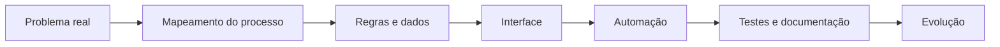

<p align="center">
  
</p>

<p align="center">
  <a href="https://www.linkedin.com/in/leonardo-farias-martins-160340215/" target="_blank">
    
  </a>
  <a href="mailto:hosttm123@gmail.com">
    
  </a>
  <a href="https://github.com/DevOPhost?tab=repositories">
    
  </a>
</p>

---

<table>
  <tr>
    <td width="58%" valign="top">

## Sobre

Sou formado em **Ciência da Computação** e construo soluções voltadas para **processos, sistemas internos, automações e aplicações web**.

Venho de um contexto onde tecnologia precisa resolver problemas concretos: planilhas que precisam fechar corretamente, dados que precisam ser confiáveis, tarefas repetitivas que consomem tempo, relatórios que precisam sair com clareza e sistemas que devem facilitar a rotina de quem usa.

Por isso, meus projetos costumam unir três pontos:

**interface bem apresentada**, **estrutura lógica organizada** e **utilidade prática**.

</td>
    <td width="42%" valign="top">

## Perfil técnico

```txt
name       Leonardo Farias
area       Systems Analysis
focus      Web Systems & Automation
base       Administrative Operations
code       JavaScript • TypeScript • Python
backend    Node.js • Express
database   MySQL • Supabase
```

<p align="center">
  
</p>

</td>
  </tr>
</table>

---

## Núcleo de atuação

<table>
  <tr>
    <td width="25%" align="center" valign="top">
      
      <br><br>
      <sub>Sistemas com telas claras, navegação objetiva e estrutura pronta para evoluir.</sub>
    </td>
    <td width="25%" align="center" valign="top">
      
      <br><br>
      <sub>Rotinas repetitivas convertidas em fluxos mais rápidos e consistentes.</sub>
    </td>
    <td width="25%" align="center" valign="top">
      
      <br><br>
      <sub>Modelagem, organização e leitura de dados para apoiar decisões.</sub>
    </td>
    <td width="25%" align="center" valign="top">
      
      <br><br>
      <sub>Experiência com processos administrativos, documentos, relatórios e controles.</sub>
    </td>
  </tr>
</table>

---

## Stack principal

<p align="center">
  
</p>

<p align="center">
  
  
  
</p>

---

## Como eu estruturo uma solução



---

## Projeto em destaque

<table>
  <tr>
    <td width="50%" valign="top">

### Estágio System

Sistema web desenvolvido para centralizar atividades de estágio, chamados de suporte, relatórios e acompanhamento de horas.

O projeto foi pensado como uma solução administrativa: simples de operar, organizada por módulos e com base preparada para evoluir.

**Principais pontos:**

* dashboard com indicadores;
* registro de atividades;
* controle de chamados;
* relatórios gerenciais;
* autenticação por perfil;
* estrutura backend/frontend/documentação.

<p>
  <a href="https://github.com/DevOPhost/estagio-system">
    
  </a>
</p>

</td>
    <td width="50%" valign="top">


</td>
  </tr>
</table>

---

## O que busco construir

<table>
  <tr>
    <td width="33%" valign="top">
      <h3>Produtos úteis</h3>
      <p>Sistemas que não existem apenas para demonstrar tecnologia, mas para organizar uma rotina, reduzir retrabalho ou melhorar uma operação.</p>
    </td>
    <td width="33%" valign="top">
      <h3>Interfaces melhores</h3>
      <p>Telas com hierarquia visual, navegação objetiva, responsividade e atenção à experiência de quem realmente vai usar.</p>
    </td>
    <td width="33%" valign="top">
      <h3>Base escalável</h3>
      <p>Projetos com estrutura clara, documentação, separação de responsabilidades e espaço para novas funcionalidades.</p>
    </td>
  </tr>
</table>

---

## GitHub em números

<p align="center">
  
  
</p>

<p align="center">
  
</p>

---

## Contato

<p align="center">
  <a href="https://www.linkedin.com/in/leonardo-farias-martins-160340215/" target="_blank">
    
  </a>
  <a href="mailto:hosttm123@gmail.com">
    
  </a>
</p>

---

<p align="center">
  
</p>

<p align="center">
  <sub>
    Sistemas bem construídos não apenas funcionam. Eles reduzem ruído, organizam processos e tornam decisões mais simples.
  </sub>
</p>


